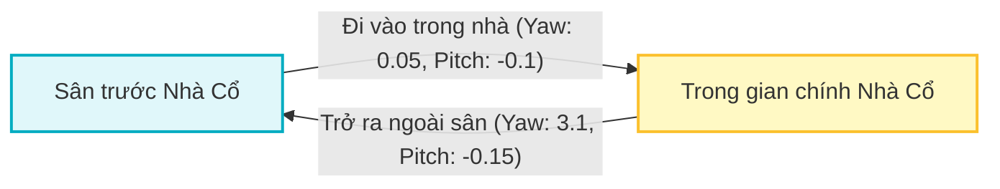
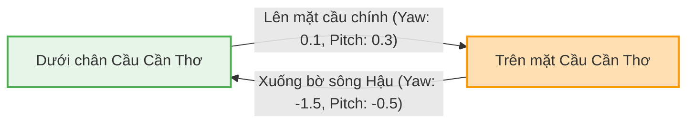

# MÔ TẢ CHI TIẾT BỘ DỮ LIỆU MẪU (CẦN THƠ DEMO DATASET)

## Smart Tourism 360 Platform

> [!NOTE]
> Tài liệu này mô tả chi tiết dữ liệu thực tế được nạp sẵn (seed data) trong hệ thống **Smart Tourism 360 Platform** khi khởi chạy môi trường phát triển hoặc chạy thử Docker.

---

## 1. Tài khoản & Phân quyền mặc định (Users & Roles)

Hệ thống cung cấp hai nhóm tài khoản quản trị mặc định phục vụ cho kiểm thử và đánh giá chức năng quản lý. Mật khẩu mặc định của tất cả tài khoản là **`Admin@123`** (đã được băm bằng thuật toán BCrypt trong cơ sở dữ liệu).

| Họ tên | Email | Vai trò (Role) | Mô tả quyền hạn |
| :--- | :--- | :--- | :--- |
| **Hệ Thống Super Admin** | `superadmin@smarttourism360.vn` | `superadmin` | Quản trị viên cấp cao nhất, quản lý toàn bộ tài khoản và cấu hình hệ thống. |
| **Quản trị viên Demo** | `admin@smarttourism360.vn` | `admin` | Quản trị viên nội dung, có quyền quản lý địa điểm, media, danh mục và cấu hình tour 360. |

---

## 2. Khu vực triển khai (Regions)

Bộ dữ liệu mẫu được xây dựng tập trung tại một khu vực địa lý:

- **Tên khu vực**: `Cần Thơ Demo`
- **Đường dẫn (Slug)**: `can-tho-demo`
- **Mô tả**: Vùng du lịch đô thị sông nước miền Tây Nam Bộ.
- **Tỉnh/Thành**: Cần Thơ.
- **Tọa độ trung tâm bản đồ**:
  - Vĩ độ (Latitude): `10.03711`
  - Kinh độ (Longitude): `105.78825`
- **Mức thu phóng mặc định (Default Zoom)**: `13` (hiển thị tối ưu toàn thành phố Cần Thơ trên bản đồ Leaflet).

---

## 3. Danh mục điểm đến (Categories)

Hệ thống định nghĩa sẵn 7 danh mục phân loại điểm đến, mỗi danh mục được trang bị màu sắc hiển thị (Mã màu HEX) và biểu tượng (icon Lucide) riêng biệt trên bản đồ:

| STT | Tên Danh mục | Slug | Icon | Màu sắc (Color) | Mô tả phân loại |
| :--- | :--- | :--- | :--- | :--- | :--- |
| 1 | **Văn hóa - Lịch sử** | `van-hoa-lich-su` | `landmark` | `#7C3AED` (Tím) | Các công trình cổ, đình chốn xưa, bảo tàng, nhà cổ. |
| 2 | **Tâm linh** | `tam-linh` | `building` | `#F59E0B` (Vàng) | Chùa, miếu, nhà thờ, địa điểm tín ngưỡng tôn giáo. |
| 3 | **Sinh thái** | `sinh-thai` | `tree-pine` | `#22C55E` (Xanh lá) | Khu du lịch sinh thái sông nước, rạch tự nhiên, bến tàu. |
| 4 | **Nông nghiệp** | `nong-nghiep` | `flower` | `#65A30D` (Xanh đọt chuối) | Vườn cây ăn trái, trang trại nông nghiệp sạch. |
| 5 | **Làng nghề** | `lang-nghe` | `wrench` | `#C2410C` (Cam đất) | Các cơ sở sản xuất thủ công lâu đời, sản phẩm OCOP. |
| 6 | **Ẩm thực** | `am-thuc` | `utensils` | `#EF4444` (Đỏ) | Quán ăn địa phương, chợ ẩm thực, đặc sản vùng miền. |
| 7 | **Lưu trú** | `luu-tru` | `home` | `#2563EB` (Xanh dương) | Homestay nghỉ dưỡng, nhà vườn, resort ven sông. |

---

## 4. Danh sách Địa điểm du lịch (Destinations)

Hệ thống tự động seed **7 địa điểm tiêu biểu** của Cần Thơ bao gồm tọa độ GPS chính xác và hình ảnh thực tế được tải tự động và lưu trữ tại Object Storage.

| Tên địa điểm | Danh mục | Tọa độ (Latitude, Longitude) | Địa chỉ thực tế | Tour 360 |
| :--- | :--- | :--- | :--- | :---: |
| **Chùa Ông Cần Thơ** | Tâm linh | `10.0348704`, `105.7865246` | Số 32 đường Hai Bà Trưng, Tân An, Ninh Kiều | ❌ |
| **Nhà Cổ Bình Thủy** | Văn hóa - Lịch sử | `10.0763267`, `105.7745778` | Số 26/1A đường Bùi Hữu Nghĩa, Bình Thủy | **Có** |
| **Chợ Nổi Cái Răng** | Sinh thái | `10.0055278`, `105.7423333` | Sông Cái Răng, Cái Răng | ❌ |
| **Cầu Cần Thơ** | Văn hóa - Lịch sử | `10.033621`, `105.807851` | Quốc lộ 1A, Hưng Phú, Cái Răng | **Có** |
| **Bến Ninh Kiều** | Sinh thái | `10.033282`, `105.788544` | Đường Hai Bà Trưng, Tân An, Ninh Kiều | ❌ |
| **Thiền Viện Trúc Lâm Phương Nam** | Tâm linh | `10.016335`, `105.698055` | Ấp Mỹ Nhơn, Mỹ Khánh, Phong Điền | ❌ |
| **Làng Du Lịch Mỹ Khánh** | Nông nghiệp | `10.012586`, `105.714488` | Số 335 lộ vòng cung, Mỹ Khánh, Phong Điền | ❌ |

---

## 5. Cấu trúc không gian Tour ảo 360 độ (Virtual Tours)

Hệ thống đã xây dựng sẵn 2 Tour ảo chất lượng cao hỗ trợ chuyển đổi không gian (navigation) và tương tác nội dung tại chỗ.

### 5.1. Tour ảo 1: Nhà Cổ Bình Thủy
- **Tiêu đề**: *Tham quan ảo Nhà Cổ Bình Thủy*
- **Điểm đứng bắt đầu (Default Scene)**: `Sân trước Nhà Cổ`

#### Sơ đồ liên kết không gian:


#### Chi tiết các Panorama & Hotspots:

##### Scene 1: Sân trước Nhà Cổ
- **Mô tả**: Góc nhìn bao quát khoảng sân gạch tàu cổ kính hướng vào mặt tiền lộng lẫy phong cách Pháp.
- **Tên file ảnh 360**: `nhaco-san-truoc.jpg` (lưu tại folder `panoramas`)
- **Danh sách Hotspots**:
  1. **Hotspot Navigation**: 
     - *Tiêu đề*: "Đi vào trong nhà cổ"
     - *Hành động*: Chuyển góc nhìn sang Scene 2 (`Trong gian chính Nhà Cổ`).
     - *Tọa độ*: `yaw: 0.05`, `pitch: -0.1`
     - *Biểu tượng*: `arrow-up`
  2. **Hotspot Info**:
     - *Tiêu đề*: "Kiến trúc hoa văn chạm nổi"
     - *Mô tả*: Các chi tiết phù điêu đắp nổi tinh xảo trên đầu cột được nghệ nhân phục dựng nguyên bản theo phong cách Phục Hưng Pháp.
     - *Tọa độ*: `yaw: 0.5`, `pitch: 0.2`

##### Scene 2: Trong gian chính Nhà Cổ
- **Mô tả**: Khám phá bàn thờ gỗ khảm xà cừ cổ kính cùng các cổ vật giá trị thời Nguyễn.
- **Tên file ảnh 360**: `nhaco-phong-khach.jpg` (lưu tại folder `panoramas`)
- **Góc nhìn ban đầu**: `initialYaw: 3.14` (tự động hướng mắt nhìn quay ngược lại về phía cửa chính khi vừa từ ngoài bước vào).
- **Danh sách Hotspots**:
  1. **Hotspot Navigation**:
     - *Tiêu đề*: "Trở ra ngoài sân trước"
     - *Hành động*: Quay về Scene 1 (`Sân trước Nhà Cổ`).
     - *Tọa độ*: `yaw: 3.1`, `pitch: -0.15`
     - *Biểu tượng*: `arrow-down`
  2. **Hotspot Audio**:
     - *Tiêu đề*: "Lịch sử dòng họ Dương Bình Thủy"
     - *Mô tả*: Nghe thuyết minh audio sơ lược về quá trình lập nghiệp của dòng họ Dương đất Nam Kỳ Lục Tỉnh và xây dựng dinh thự này.
     - *Địa chỉ phát file thuyết minh*: [SoundHelix-Song-1.mp3](https://www.soundhelix.com/examples/mp3/SoundHelix-Song-1.mp3)
     - *Tọa độ*: `yaw: -0.4`, `pitch: -0.05`

---

### 5.2. Tour ảo 2: Cầu Cần Thơ
- **Tiêu đề**: *Khám phá Cầu Cần Thơ từ trên cao*
- **Điểm đứng bắt đầu (Default Scene)**: `Dưới chân Cầu Cần Thơ`

#### Sơ đồ liên kết không gian:


#### Chi tiết các Panorama & Hotspots:

##### Scene 1: Dưới chân Cầu Cần Thơ
- **Mô tả**: Góc ngắm nhìn những cột trụ bê tông khổng lồ đỡ nhịp cầu từ bến đò cũ sông Hậu.
- **Tên file ảnh 360**: `cau-duoi-chan.jpg` (lưu tại folder `panoramas`)
- **Danh sách Hotspots**:
  1. **Hotspot Navigation**:
     - *Tiêu đề*: "Lên mặt cầu chính"
     - *Hành động*: Chuyển tiếp góc nhìn lên Scene 2 (`Trên mặt Cầu Cần Thơ`).
     - *Tọa độ*: `yaw: 0.1`, `pitch: 0.3`
     - *Biểu tượng*: `arrow-up`

##### Scene 2: Trên mặt Cầu Cần Thơ
- **Mô tả**: Đứng giữa làn dây văng đỏ cam rực rỡ dưới nắng chiều sông nước miền Tây.
- **Tên file ảnh 360**: `cau-tren-mat.jpg` (lưu tại folder `panoramas`)
- **Góc nhìn ban đầu**: `initialYaw: 1.57`
- **Danh sách Hotspots**:
  1. **Hotspot Navigation**:
     - *Tiêu đề*: "Xuống bờ sông Hậu"
     - *Hành động*: Chuyển về Scene 1 (`Dưới chân Cầu Cần Thơ`).
     - *Tọa độ*: `yaw: -1.5`, `pitch: -0.5`
     - *Biểu tượng*: `arrow-down`
  2. **Hotspot Info**:
     - *Tiêu đề*: "Kỷ lục chiều dài nhịp cầu"
     - *Mô tả*: Cầu có tổng chiều dài toàn tuyến là 15,85km, nhịp chính dây văng dài 550m nối liền Vĩnh Long và Cần Thơ.
     - *Tọa độ*: `yaw: 0.8`, `pitch: 0.1`

---

## 6. Cấu trúc lưu trữ tệp tin trên MinIO (Object Storage)

Tất cả các tài nguyên ảnh đại diện, ảnh panorama 360 độ và thumbnail đều được tự động tải từ nguồn lưu trữ mẫu trực tuyến và lưu trữ cục bộ vào bucket tên **`smart-tourism-360`** trên MinIO theo sơ đồ thư mục sau:

```
smart-tourism-360 (Bucket chính)
  ├── images/
  │     └── covers/
  │           ├── chua-ong-can-tho-cover.jpg
  │           ├── nha-co-binh-thuy-cover.jpg
  │           ├── cho-noi-cai-rang-cover.jpg
  │           ├── cau-can-tho-cover.jpg
  │           ├── ben-ninh-kieu-cover.jpg
  │           ├── thien-vien-truc-lam-phuong-nam-cover.jpg
  │           └── lang-du-lich-my-khanh-cover.jpg
  │
  ├── panoramas/
  │     ├── nhaco-san-truoc.jpg
  │     ├── nhaco-phong-khach.jpg
  │     ├── cau-duoi-chan.jpg
  │     └── cau-tren-mat.jpg
  │
  └── images/
        └── thumbnails/
              ├── nha-co-tour-thumb.jpg
              └── cau-can-tho-tour-thumb.jpg
```

---

## 7. Hướng dẫn Reset & Nạp lại Bộ dữ liệu

Trong quá trình phát triển dự án hoặc khi kiểm thử bị lỗi dữ liệu, bạn có thể đưa toàn bộ cơ sở dữ liệu và thư viện ảnh về trạng thái ban đầu bằng cách thực hiện các bước sau:

> [!WARNING]
> Thao tác reset sẽ xóa toàn bộ các thay đổi thủ công (địa điểm ghim thêm, ảnh mới tải lên) mà bạn đã tạo trên Dashboard. Hãy sao lưu nếu cần thiết.

```bash
# Bước 1: Dừng toàn bộ dịch vụ và xóa sạch volumes lưu trữ dữ liệu
docker compose down -v

# Bước 2: Khởi động lại hệ thống ở chế độ build mới
docker compose up -d --build
```
Sau khi khởi động lại, dịch vụ Backend API sẽ tự động phát hiện database trống, tự động thực thi quá trình Migration để vẽ lại cấu trúc bảng, tải tệp tin mẫu và nạp lại chính xác bộ dữ liệu mô tả ở trên vào PostgreSQL và MinIO.
